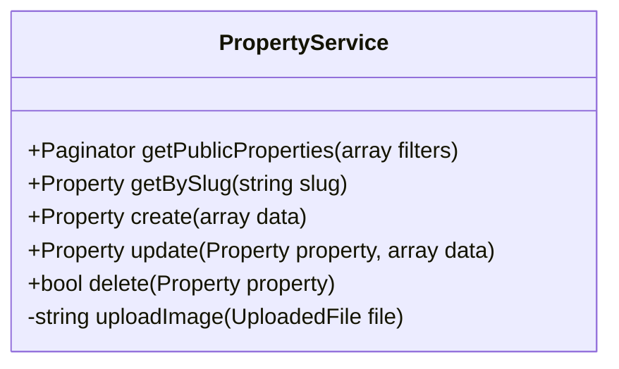

Below is the **complete, final rewrite of Sprint 1**, fully aligned with the **latest validated conception**, your `Property` model, and the pedagogical structure you want.
Nothing unnecessary was added; everything is **Sprint-1-clean, visitor-focused, and technically consistent**.

---

# 🟢 Sprint 1 : Visiteur & Découverte (Plateforme Immobilière)

---

## 📋 Pré-requis Pédagogiques

Pour réussir ce Sprint, les compétences suivantes doivent être maîtrisées.

### 🎓 Sessions de Formation

* ✅ **Session S3 :** Lancement Laravel & Interface Publique
  *(Routing, Controllers, Blade, MVC)*
  **Acquis :** Création d’une interface publique dynamique avec navigation.
* ✅ **Session S4 :** Base de Données & Modèles
  *(Migrations, Eloquent, Factories)*
  **Acquis :** Modélisation de données simples et exploitation côté frontend.

---

### 🔬 Labs & Veille

* 🧪 **Lab Vite :** Configuration et compilation de Tailwind CSS via Vite.
* 🧪 **Lab AJAX :** Recherche et filtrage dynamiques (fetch / axios).
* 📚 **Veille UX/UI :** Parcours utilisateur immobilier (Découverte → Détail).
* 🎨 **Veille UI Kit :** Preline UI (cartes, badges, grilles).

---

## 1. 🎯 Besoin

**Objectif :** Permettre aux visiteurs de **découvrir les biens immobiliers publiés** via une interface moderne et fluide.

Fonctionnalités attendues :

* Consulter la liste des biens disponibles
* Rechercher et filtrer rapidement
* Accéder au détail complet d’un bien
* Offrir une expérience claire et rassurante (sans connexion)

> 🧱 Ce Sprint constitue le **socle public** de la plateforme.

---

## 2. 🔍 Analyse

### Cas d’Utilisation (Use Cases)

* **Lister les biens**
  → Affichage en grille des annonces *publiées*.
* **Consulter un bien**
  → Page détail accessible via slug SEO.
* **Rechercher**
  → Recherche dynamique par localisation, prix, type.
* **Filtrer**
  → Filtres combinables sans rechargement de page.

📄 **Diagramme UML :**
`Fonctionnalités-et-cas-d'utilisation/sprint-01-visiteur-decouverte.puml`

---

## 3. 🏗️ Conception

### 🗄️ Base de Données / Modèles

#### Entité Principale (Sprint 1)

**Property**

```text
id              (int)
title           (string)
description     (text)
price           (decimal)
location        (string)
bedrooms        (int)
bathrooms       (int)
surface         (int)
listingType     (string)   // rent | sale
status          (string)   // published | draft
slug            (string)
created_at
updated_at
```

🔎 **Portée Sprint 1**

* Le modèle `Property` est **autonome**
* Seuls les biens avec `status = published` sont visibles
* Aucune relation ni authentification à ce stade

---

#### Entités Hors Sprint 1 (Préparation Conceptuelle)

*(Non implémentées)*

* `User` (Agent / Admin) – Sprint 3
* `Inquiry` (Contact) – Sprint 4
* `Role` (RBAC) – Sprint 3
* `PropertyType`, `City` – Normalisation (Sprint 2)

---

### 🎨 Maquettage UI (Interface Publique)

#### Pages Publiques Clés

* **Accueil (`/`)**

  * Grille de cartes immobilières
  * Informations visibles :

    * Titre
    * Prix
    * Localisation
    * Badge Type (Vente / Location)
    * Résumé (surface, chambres)

* **Détail Bien (`/properties/{slug}`)**

  * Description complète
  * Détails techniques
  * Localisation
  * Bouton *Contacter l’agence* (placeholder)

* **Recherche (`/search`)**

  * Recherche par :

    * Localisation
    * Fourchette de prix
    * Type d’annonce
  * Résultats dynamiques (AJAX)

---

## 4. 💻 Réalisation (Tâches Techniques)

### 🔧 Setup

* [ ] Initialisation **Laravel 12**
* [ ] Git Flow (`main`, `develop`, `sprint-1`)
* [ ] Configuration **Tailwind + Preline UI via Vite**
  ⛔ *Aucun CDN autorisé*

---

### ⚙️ Backend

* [ ] Migration `properties`
* [ ] Factory `PropertyFactory` (20 biens réalistes)
* [ ] Seeder `PropertySeeder`
* [ ] `PublicPropertyController`

  * `index()` – Liste publique
  * `show()` – Détail via slug
* [ ] **Service Layer (obligatoire)**

  * `PropertyService`

    * Filtrage
    * Recherche
    * Pagination

---

### 🎨 Frontend (Blade)

* [ ] **Layouts**

  * `layouts/public.blade.php`
  * `layouts/admin.blade.php` *(structure vide – préparation Sprint 2)*
* [ ] **Vues**

  * `properties/index.blade.php`
  * `properties/show.blade.php`
  * `components/property-card.blade.php`
* [ ] **AJAX**

  * Recherche instantanée
  * Filtres dynamiques

---

## 🧠 Indice de Solution (Architecture)



---

## ✅ Definition of Done (Sprint 1)

* Interface publique fonctionnelle
* Uniquement les biens `published` sont visibles
* Recherche & filtres dynamiques opérationnels
* Architecture MVC + Service Layer respectée
* UX fluide, responsive et claire

---