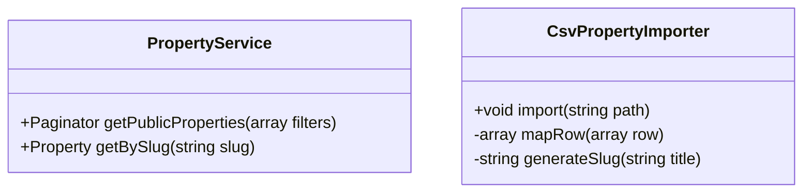

# 🟢 Sprint 1 : Visiteur & Découverte (Plateforme Immobilière)

---

## 📋 Pré-requis Pédagogiques

Pour réussir ce Sprint, les compétences suivantes doivent être maîtrisées.

### 🎓 Sessions de Formation

* ✅ **Session S3 :** Lancement Laravel & Interface Publique
  *(Routing, Controllers, Blade, MVC)*
  **Acquis :** Création d’une interface publique dynamique.
* ✅ **Session S4 :** Base de Données & Modèles
  *(Migrations, Eloquent, Factories, Seeders)*
  **Acquis :** Manipulation et alimentation de la base de données.

---

### 🔬 Labs & Veille

* 🧪 **Lab Vite :** Configuration de Tailwind CSS via Vite.
* 🧪 **Lab AJAX :** Recherche et filtrage dynamiques.
* 🧪 **Lab CSV :** Import de données depuis un fichier CSV en Laravel.
* 📚 **Veille UX/UI :** Parcours utilisateur immobilier (Découverte → Détail).
* 🎨 **Veille UI Kit :** Preline UI (cartes, badges).

---

## 1. 🎯 Besoin

**Objectif :** Permettre aux visiteurs de **découvrir des biens immobiliers publiés**, avec des **données réalistes importées depuis un fichier CSV**.

Fonctionnalités attendues :

* Consulter des annonces crédibles (données réelles ou semi-réelles)
* Rechercher et filtrer efficacement
* Accéder au détail complet d’un bien
* Bénéficier d’un socle de données stable pour les sprints suivants

> 📌 Le CSV remplace la saisie manuelle et garantit un dataset cohérent.

---

## 2. 🔍 Analyse

### Cas d’Utilisation (Use Cases)

* **Lister les biens** → Grille publique
* **Consulter un bien** → Page détail via slug
* **Rechercher** → Par localisation, prix, type
* **Filtrer** → Sans rechargement (AJAX)

📄 **Diagramme UML :**
`sprint-01-visiteur-decouverte.puml`

---

## 3. 🏗️ Conception

### 🗄️ Base de Données / Modèles

#### Entité Principale (Sprint 1)

**Property**

```text
id              (int)
title           (string)
description     (text)
price           (decimal)
location        (string)
bedrooms        (int)
bathrooms       (int)
surface         (int)
listingType     (string)   // rent | sale
status          (string)   // published | draft
slug            (string)
created_at
updated_at
```

🔎 **Portée Sprint 1**

* Le modèle `Property` est autonome
* Les données sont **injectées via CSV**
* Seuls les biens `published` sont visibles
* Pas de relations, pas d’authentification

---

#### Entités Hors Sprint 1 (Préparation Conceptuelle)

*(Non implémentées)*

* `User` – Sprint 3
* `Inquiry` – Sprint 4
* `Role` – Sprint 3
* `PropertyType`, `City` – Sprint 2

---

### 🎨 Maquettage UI (Interface Publique)

* **Accueil (`/`)** – Grille de cartes immobilières
* **Détail (`/properties/{slug}`)** – Informations complètes
* **Recherche (`/search`)** – Résultats dynamiques

Orientation UI :

* Prix mis en avant
* Badge type (rent / sale)
* Localisation claire

---

## 4. 💻 Réalisation (Tâches Techniques)

### 🔧 Setup

* [ ] Laravel 12 + Git Flow (`sprint-1`)
* [ ] Tailwind + Preline UI via Vite
  ⛔ Pas de CDN

---

### ⚙️ Backend

#### 🗄️ Base de Données

* [ ] Migration `properties`
* [ ] Ajout champ `slug` (unique)
* [ ] Index sur `status`, `price`, `location`

---

#### 📥 Import CSV (Tâche Clé Sprint 1)

* [ ] Création d’un fichier `properties.csv`
* [ ] Commande Artisan :

  ```bash
  php artisan properties:import-csv
  ```
* [ ] Lecture CSV ligne par ligne
* [ ] Mapping CSV → modèle `Property`
* [ ] Génération automatique du `slug`
* [ ] Validation minimale des données
* [ ] Insertion en base

📌 **Le CSV est stocké dans** `storage/app/data/properties.csv`

---

#### 🔧 Services

* [ ] `PropertyService`

  * `getPublicProperties(array $filters)`
  * `getBySlug(string $slug)`

---

### 🎨 Frontend (Blade)

* [ ] `layouts/public.blade.php`
* [ ] `layouts/admin.blade.php` *(vide – Sprint 2)*
* [ ] `properties/index.blade.php`
* [ ] `properties/show.blade.php`
* [ ] `components/property-card.blade.php`

---

### ⚡ AJAX

* [ ] Recherche instantanée
* [ ] Filtres dynamiques (prix, type, localisation)

---

## 🧠 Indice de Solution (Architecture)



---

## ✅ Definition of Done (Sprint 1)

* Données chargées depuis CSV
* Aucune saisie manuelle requise
* Interface publique fonctionnelle
* Filtres & recherche opérationnels
* Architecture Service Layer respectée
* Base prête pour CRUD (Sprint 2)

---