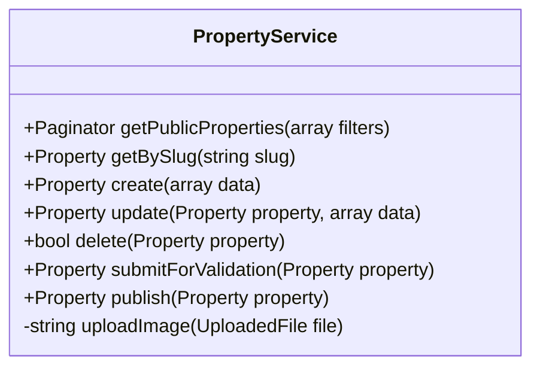

# 🟡 Sprint 2 : Publication (Back-Office sans Auth)

## 📋 Pré-requis Pédagogiques

Pour réussir ce Sprint, vous devez avoir validé la session de formation suivante :

### 🎓 Sessions de Formation

* ✅ **Session S5 :** CRUD, Formulaires & Validation
  *Acquis :* Création d’un **Back-Office Laravel** avec gestion complète des données (Create, Read, Update, Delete).

---

## 1. 📝 Besoin

**Objectif :** Offrir une interface de **publication interne** pour gérer les annonces immobilières.

> ⚠️ **Note Importante :**
> Ce Sprint se concentre uniquement sur la **logique métier (CRUD & Workflow)**.
> **Aucune authentification** n’est encore appliquée.
> L’interface est accessible publiquement (ex : `/admin/properties`) et sera **sécurisée au Sprint 3**.

Fonctionnalités attendues :

* Créer, modifier et supprimer des annonces immobilières.
* Gérer les images des biens.
* Gérer le cycle de publication (brouillon → en attente → publié).
* Faciliter la recherche et le filtrage dans le back-office.

---

## 2. 🔍 Analyse

### Cas d’Utilisation (Use Cases)

* **Gérer les annonces** : Créer / Modifier / Supprimer.
* **Uploader des médias** : Image principale + galerie.
* **Soumettre pour validation** : Passage en statut *pending*.
* **Valider et publier** : Rendre visible côté public.
* **Rechercher & Filtrer** : Par statut, type de bien, ville.

📄 **Diagramme UML :**
`sprint-02-publication.puml`

---

## 3. 🏗️ Conception

### 🎨 Maquettage UI

* **Back-Office – Pages clés :**

  * Liste des annonces (tableau de gestion)
  * Formulaire Création / Édition
* **Composants UI :**

  * Sidebar admin
  * Badges de statut (`draft`, `pending`, `published`)
  * Actions rapides (éditer, supprimer)

---

## 4. 💻 Réalisation (Tâches Techniques)

### ⚙️ Contraintes Techniques Critiques

* 🌍 **Internationalisation (i18n)**
  Toutes les chaînes (labels, statuts, messages d’erreur) doivent passer par :

  ```
  lang/fr/*.php
  ```

  ⛔ Aucun texte en dur dans les vues ou contrôleurs.

* 🧱 **Architecture (Service Layer obligatoire)**
  Toute la logique métier doit être placée dans :

  * `PropertyService`

  Le contrôleur :

  * Valide la requête
  * Appelle le service
  * Retourne la réponse

* ⚡ **UX Dynamique (AJAX / Alpine / Livewire)**
  Recherche, filtres et pagination **sans rechargement de page**.

---

### 🧩 Tâches Détaillées

#### ⚙️ Backend

* [ ] `PropertyController` (Resource Controller)
* [ ] `PropertyRequest` (Validation stricte)
* [ ] `PropertyService`

  * Gestion CRUD
  * Gestion des statuts
  * Upload images
* [ ] **API interne**

  * Endpoint AJAX pour recherche & filtres

---

#### 🎨 Frontend (Preline UI)

* [ ] **Layout Admin**

  * `layouts/admin.blade.php`
  * Sidebar + Header + Slot `@yield('content')`
* [ ] **Vue Index**

  * Tableau des annonces
  * Recherche instantanée (AJAX)
  * Filtres :

    * Statut
    * Type de bien
    * Ville
  * Pagination
* [ ] **Vue Form**

  * Création / Édition
  * Upload image(s)
  * Messages d’erreur traduits (i18n)

---

## 🧠 Indice de Solution (Architecture)



---

## ✅ Definition of Done (Sprint 2)

* Back-office CRUD fonctionnel
* Upload image opérationnel
* Gestion des statuts implémentée
* Recherche & filtres dynamiques
* Service Layer respecté
* i18n respectée à 100 %

---

### Prochaine Étape

👉 **Sprint 3 : Auth & Rôles (Sécurité RBAC)**
Sécurisation complète du back-office et séparation Admin / Assistant.

Si tu veux, je peux aussi :

* Générer le **PlantUML du Sprint 2**
* Créer les **migrations exactes**
* Fournir un **squelette de PropertyService**

Dis-moi 👍
